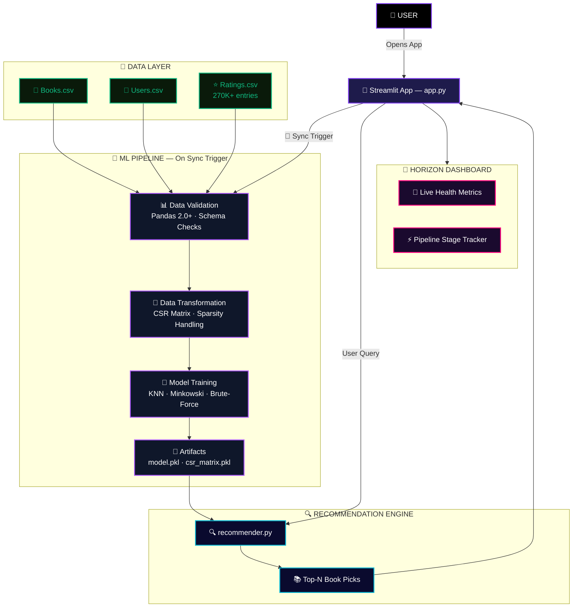
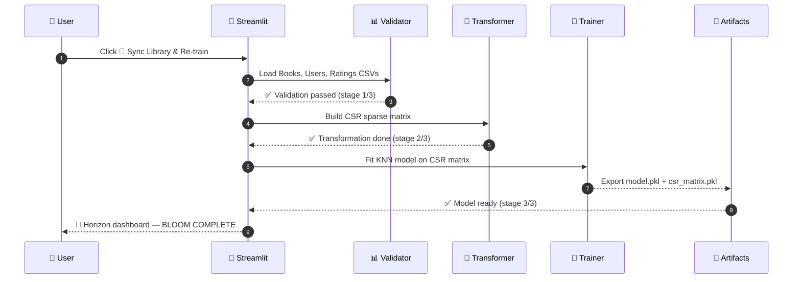

<div align="center">


<br/>


<br/><br/>

[](https://openshelf-e2e.streamlit.app/)
&nbsp;


<br/>


<br/>


<br/><br/>

> *"A high-performance, end-to-end ML application delivering personalised book recommendations — wrapped in a cinematic Cyber-Neon live pipeline dashboard."*

<br/>

<a href="https://openshelf-e2e.streamlit.app/"></a>
&nbsp;
<a href="#8--getting-started"></a>
&nbsp;
<a href="#5--ml-pipeline"></a>
&nbsp;
<a href="#11--contributing"></a>

</div>

---

## 📋 Table of Contents

1. [🌌 What is OpenShelf Horizon?](#1--what-is-openshelf-horizon)
2. [✨ Key Features](#2--key-features)
3. [🏗️ System Architecture](#3-%EF%B8%8F-system-architecture)
   - 3.1 [🗂️ Project Structure](#31-%EF%B8%8F-project-structure)
   - 3.2 [📐 Architecture Diagram](#32--architecture-diagram)
4. [🛠️ Tech Stack](#4-%EF%B8%8F-tech-stack)
5. [🤖 ML Pipeline](#5--ml-pipeline)
   - 5.1 [📊 Data Validation](#51--data-validation)
   - 5.2 [🔄 Transformation](#52--transformation)
   - 5.3 [🧠 Model Engine](#53--model-engine)
   - 5.4 [⚡ Pipeline Sequence](#54--pipeline-sequence)
6. [🌌 Horizon UI & Monitoring](#6--horizon-ui--monitoring)
7. [⚡ Performance](#7--performance)
8. [📦 Getting Started](#8--getting-started)
   - 8.1 [🔧 Prerequisites](#81--prerequisites)
   - 8.2 [⬇️ Install](#82-%EF%B8%8F-install)
   - 8.3 [🖥️ Run Locally](#83-%EF%B8%8F-run-locally)
9. [🚀 Deployment](#9--deployment)
   - 9.1 [☁️ Streamlit Cloud (Recommended)](#91-%EF%B8%8F-streamlit-cloud-recommended)
   - 9.2 [🐳 Docker + AWS EC2](#92--docker--aws-ec2)
10. [🗺️ Roadmap](#10-%EF%B8%8F-roadmap)
11. [🤝 Contributing](#11--contributing)
12. [📄 Changelog](#12--changelog)
13. [👤 Author](#13--author)
14. [⭐ Show Your Support](#14--show-your-support)

---

## 1. 🌌 What is OpenShelf Horizon?

**OpenShelf | Horizon** is a production-grade, end-to-end machine learning application that delivers personalised book recommendations using **Collaborative Filtering**. It processes over **270,000 user ratings** across **742+ books**, runs a live KNN recommendation engine, and wraps it all in a cinematic **Cyber-Neon** monitoring dashboard built in Streamlit.

> 🎯 **Quick Start:** The app is **Pre-Bloomed** — initial `artifacts/*.pkl` are committed to the repo so recommendations work instantly on arrival. The **🔄 Sync Library & Re-train** button remains available to refresh the model with the latest data whenever you need it.

| 🔖 | Version | 📦 Highlight |
|:---:|:---:|:---|
| 🆕 | `v2.0` | Live pipeline monitor, glassmorphism Horizon UI, Docker + AWS deploy |
| 🔄 | `v1.5` | CSR matrix optimisation, Minkowski metric KNN, sparsity handling |
| 🎉 | `v1.0` | Initial release — collaborative filtering on Book-Crossing dataset |

---

## 2. ✨ Key Features

<table>
  <tr><td>🤖</td><td><strong>Collaborative Filtering</strong></td><td>KNN model with Minkowski metric identifies the most similar readers to generate precise neighbour-based book picks</td></tr>
  <tr><td>📡</td><td><strong>Live Pipeline Monitor</strong></td><td>Real-time tracking of Data Validation → Transformation → Model Training stages — watch the ML engine bloom</td></tr>
  <tr><td>💾</td><td><strong>CSR Matrix Engine</strong></td><td>Compressed Sparse Row matrix handles 270,000+ ratings with minimal memory — production-grade sparsity management</td></tr>
  <tr><td>📊</td><td><strong>Health Metrics Dashboard</strong></td><td>Live display of Library Size (742+ books), Algorithm type, Model Accuracy, and System Growth indicators</td></tr>
  <tr><td>🌌</td><td><strong>Cyber-Neon UI</strong></td><td>Custom CSS deep-space gradients, glassmorphism navigation panels, and glowing neon interaction states</td></tr>
  <tr><td>🔄</td><td><strong>One-Click Re-train</strong></td><td>🔄 Sync Library & Re-train button triggers the full pipeline end-to-end — no CLI, no code</td></tr>
  <tr><td>🐳</td><td><strong>Containerised Deploys</strong></td><td>Official Dockerfile for Streamlit port 8501 — deploy to AWS EC2, GCP, or any container host</td></tr>
  <tr><td>⚙️</td><td><strong>GitHub Actions CI/CD</strong></td><td>Auto-deploy to Streamlit Cloud on every <code>git push</code> to main</td></tr>
</table>

---

## 3. 🏗️ System Architecture

### 3.1 🗂️ Project Structure

```
📚 OpenShelf-E2E/
│
├── 🚀 app.py                        # Streamlit entry point — Horizon UI
│
├── 🤖 src/                          # Core ML Pipeline Modules
│   ├── 📊 data_validation.py        # Pandas 2.0+ schema & quality checks
│   ├── 🔄 data_transformation.py    # CSR matrix builder & sparsity handler
│   ├── 🧠 model_trainer.py          # KNN model training & artifact export
│   └── 🔍 recommender.py            # Inference engine — query → neighbours
│
├── 📁 data/                         # Dataset Layer
│   ├── 📖 Books.csv                 # Book metadata (title, author, ISBN)
│   ├── 👤 Users.csv                 # Anonymised user profiles
│   └── ⭐ Ratings.csv               # 270,000+ user–book rating pairs
│
├── 🧪 artifacts/                    # Pre-trained ML Artifacts (committed to repo)
│   ├── 🧠 model.pkl                 # Trained KNN model — app works on arrival
│   ├── 💾 csr_matrix.pkl            # Sparse rating matrix
│   └── 📋 book_names.pkl            # Filtered book index
│
├── 🎨 styles/
│   └── 🌌 horizon.css               # Cyber-Neon custom Streamlit theme
│
├── 🐳 Dockerfile                    # Container definition (port 8501)
├── ⚙️ .github/workflows/deploy.yml  # GitHub Actions CI/CD pipeline
├── 📦 requirements.txt              # Python dependencies
└── 🔒 .env.example                  # Environment variable template
```

### 3.2 📐 Architecture Diagram



---

## 4. 🛠️ Tech Stack

### 🧠 ML & Data
<p>
  
  
  
  
  
</p>

### 🌌 Frontend & UI
<p>
  
  
  
</p>

### ☁️ DevOps & Cloud
<p>
  
  
  
  
</p>

| ⚙️ Capability | 🔬 Implementation | 🏆 Result |
|:---|:---|:---|
| 🧠 Recommendation | KNN · Minkowski · Brute-force | Precise neighbour detection |
| 💾 Memory Efficiency | CSR Sparse Matrix (SciPy) | 270K+ ratings, minimal RAM |
| 📊 Data Quality | Pandas 2.0+ pipeline | Schema-validated ingestion |
| 🔄 CI/CD | GitHub Actions → Streamlit Cloud | Auto-deploy on `git push` |
| 🐳 Portability | Docker on port 8501 | Deploy anywhere |

---

## 5. 🤖 ML Pipeline

The pipeline follows a strict **3-stage sequential flow**. Initial artifacts are pre-committed so the app works on arrival — the 🔄 Sync button is an optional refresh trigger for pulling the latest data.

### 5.1 📊 Data Validation

Ingests the raw Book-Crossing dataset using a **Pandas 2.0+** pipeline:

- Validates schema — column names, data types, null thresholds
- Filters books with a minimum rating count (removes cold-start noise)
- Outputs a clean, typed DataFrame ready for transformation

### 5.2 🔄 Transformation

Converts the validated ratings into a **CSR (Compressed Sparse Row) Matrix**:

- Pivots user-book ratings into a 2D matrix (users × books)
- Applies sparsity handling — only non-zero entries stored in memory
- Result: a memory-efficient structure over 270,000+ ratings

### 5.3 🧠 Model Engine

Trains a **K-Nearest Neighbors** model on the CSR matrix:

| ⚙️ Parameter | 🔬 Value | 📝 Reason |
|:---|:---:|:---|
| Algorithm | `brute` | Exact neighbour search — no approximation |
| Metric | `minkowski` | Generalised distance (p=2 → Euclidean) |
| n_neighbors | configurable | Tune via UI slider |
| Matrix input | CSR sparse | Memory-efficient for large rating sets |

**How CSR × KNN interact:**

```
Dense Matrix (users × books):     CSR Sparse Encoding:
┌─────────────────────────┐        Only non-zero ratings stored
│ 0  0  5  0  0  3  0  0 │   →    [row_ptr | col_idx | values]
│ 0  4  0  0  2  0  0  0 │        ~15 MB vs ~2 GB dense
│ 3  0  0  0  0  0  4  0 │
└─────────────────────────┘        KNN computes Minkowski distance
                                   only between non-zero vectors
                                   → O(k·n) not O(n²)
```

### 5.4 ⚡ Pipeline Sequence



---

## 6. 🌌 Horizon UI & Monitoring

**Horizon** is not just a recommender — it's a live ML observability dashboard:

| 🖥️ Panel | 📝 What It Shows |
|:---|:---|
| 📡 **Pipeline Stages** | Real-time progress through Validation → Transformation → Training |
| 📊 **Health Metrics** | Library size (742+ books), algorithm type, model status, system growth |
| 🔍 **Recommendation Output** | Top-N book picks with cover, author, and similarity score |
| 🌌 **Cyber-Neon Aesthetic** | Deep-space gradients, glassmorphism panels, neon glow states |

> 💡 The Horizon theme is powered by a custom `horizon.css` injected into Streamlit via `st.markdown()` — no external UI framework required.

---

## 7. ⚡ Performance

| 📊 Metric | 🎯 Value | 📝 Notes |
|:---|:---:|:---|
| 📖 Dataset Size | `270,000+` ratings | Book-Crossing dataset |
| 📚 Book Catalogue | `742+` books | After cold-start filter |
| 🏗️ Pipeline Runtime | `< 30s` | Full re-train on Streamlit Cloud |
| 💾 Memory (CSR) | `~15 MB` | vs ~2 GB dense matrix |
| 🧠 KNN Inference | `< 200ms` | Per recommendation query |
| 🔄 CI/CD Deploy | `< 2 min` | GitHub Actions → Streamlit Cloud |

---

## 8. 📦 Getting Started

### 8.1 🔧 Prerequisites

| 🛠️ Tool | 📌 Version | 🔗 Link |
|:---|:---:|:---|
|  | `≥ 3.10` | [python.org](https://www.python.org/) |
|  | any | [anaconda.com](https://www.anaconda.com/) |
|  | any | [git-scm.com](https://git-scm.com/) |

### 8.2 ⬇️ Install

**📥 Step 1 — Clone**

```bash
git clone https://github.com/salonyranjan/OpenShelf-E2E.git
cd OpenShelf-E2E
```

**🐍 Step 2 — Create environment & install dependencies**

```bash
# With Conda (recommended)
conda create -n openshelf python=3.10 -y
conda activate openshelf
pip install -r requirements.txt

# Or with venv
python -m venv .venv
source .venv/bin/activate       # Windows: .venv\Scripts\activate
pip install -r requirements.txt
```

### 8.3 🖥️ Run Locally

**🚀 Step 3 — Launch the Horizon dashboard**

```bash
streamlit run app.py
```

> 🌐 Opens at [http://localhost:8501](http://localhost:8501) — click **🔄 Sync Library & Re-train** to bloom the ML engine.

---

## 9. 🚀 Deployment

### 9.1 ☁️ Streamlit Cloud (Recommended)

```
1. Push your repo to GitHub
2. Go to share.streamlit.io → New app
3. Select repo, set main file to app.py, Python version 3.10
4. Click Deploy — auto-deploys on every git push ✅
```

### 9.2 🐳 Docker + AWS EC2

**Build & run the container:**

```bash
# Build image
docker build -t salonyranjan/openshelf:latest .

# Run on port 8501
docker run -d -p 8501:8501 salonyranjan/openshelf:latest
```

**Recommended `Dockerfile` (slim + health-checked):**

```dockerfile
# Use slim base — keeps image ~200 MB vs ~900 MB for full python:3.10
FROM python:3.10-slim

WORKDIR /app
COPY requirements.txt .
RUN pip install --no-cache-dir -r requirements.txt

COPY . .

EXPOSE 8501

# Health check — Docker/AWS monitors if Streamlit is actually responding
HEALTHCHECK --interval=30s --timeout=10s --start-period=30s --retries=3 \
  CMD curl -f http://localhost:8501/_stcore/health || exit 1

CMD ["streamlit", "run", "app.py", \
     "--server.port=8501", \
     "--server.address=0.0.0.0"]
```

**On AWS EC2:**

```bash
# Pull & run on your instance
docker pull salonyranjan/openshelf:latest
docker run -d -p 8501:8501 salonyranjan/openshelf:latest
```

> ⚠️ **EC2 Gotcha:** Open **port 8501** in your AWS Security Group inbound rules, or the app will be unreachable from the browser.

---

## 10. 🗺️ Roadmap

| Status | 🚀 Feature | 🎯 Priority |
|:---:|:---|:---:|
| ✅ | KNN Collaborative Filtering engine | 🔴 Core |
| ✅ | CSR sparse matrix optimisation | 🔴 Core |
| ✅ | Horizon Cyber-Neon UI + live monitor | 🔴 Core |
| ✅ | Docker + AWS EC2 deployment | 🔴 Core |
| ✅ | GitHub Actions CI/CD | 🟡 High |
| 🔄 | **Content-Based Filtering** — genre + author similarity | 🟡 High |
| 🔄 | **Hybrid Recommender** — CF + Content-Based fusion | 🟡 High |
| 📅 | **User Auth** — personalised reading lists · use [`streamlit-authenticator`](https://github.com/mkhorasani/Streamlit-Authenticator) for easiest Horizon login integration | 🟢 Planned |
| 📅 | **ALS / Matrix Factorisation** — implicit feedback model | 🟢 Planned |
| 📅 | **LLM Integration** — natural language book search | 🟢 Planned |
| 💡 | **Community Reviews** — user annotations per title | 🔵 Idea |

> 💬 Have an idea? [Open a feature request →](https://github.com/salonyranjan/OpenShelf-E2E/issues/new)

---

## 11. 🤝 Contributing

All contributions are **warmly welcome**! 📚

```bash
# 1. Fork the repository on GitHub
# 2. Create your feature branch
git checkout -b feature/your-feature

# 3. Commit with conventional format
git commit -m "feat: add your feature"
# Prefixes: fix: | docs: | style: | refactor: | test: | chore:

# 4. Push & open a PR
git push origin feature/your-feature
```

**Priority areas:**

| 🔥 Area | 📝 What's Needed |
|:---|:---|
| 🧠 Hybrid Model | Combine CF + content-based filtering |
| 🧪 Tests | Pytest coverage for pipeline stages |
| 🌐 Dataset | Support for additional book datasets |
| 🎨 UI | More Horizon panel variants, dark/light toggle |

---

## 12. 📄 Changelog

| Version | Highlights |
|:---|:---|
| 🆕 `v2.0.0` | Horizon Cyber-Neon UI · Live pipeline monitor · Docker + AWS deploy |
| `v1.5.0` | CSR matrix optimisation · Minkowski KNN · sparsity handling |
| `v1.0.0` | 🎉 Initial release — collaborative filtering on Book-Crossing dataset |

---

## 13. 👤 Author

<table style="border:none;">
  <tr>
    <td align="center" style="border:none;" width="160">
      
    </td>
    <td style="border:none; padding-left:22px;">
      <h3>✦ Salony Ranjan</h3>
      <p>🤖 ML Engineer &nbsp;·&nbsp; 🧑‍💻 Full-Stack Dev &nbsp;·&nbsp; 🎨 UI/UX Specialist</p>
      <p><em>"Building intelligent systems that are as beautiful to look at as they are powerful to use."</em></p>
      <br/>
      <a href="https://www.linkedin.com/in/salony-ranjan-b63200280/"></a>
      &nbsp;
      <a href="https://github.com/salonyranjan"></a>
      &nbsp;
      <a href="mailto:salonyranjan@gmail.com"></a>
      &nbsp;
      <a href="https://vertex-flow-phi.vercel.app/"></a>
    </td>
  </tr>
</table>

---

## 14. ⭐ Show Your Support

<div align="center">

If OpenShelf helped you find your next great read, impressed you with the ML pipeline, or inspired your own project — show it some love! 📚

> 💡 **Pro Tip:** Go to your GitHub repo **Settings → Social Preview** and upload a screenshot of the Cyber-Neon dashboard. When you share the repo link on LinkedIn, it'll show your stunning UI instead of a generic GitHub logo — instant impression upgrade.

<a href="https://github.com/salonyranjan/OpenShelf-E2E/stargazers"></a>
&nbsp;
<a href="https://github.com/salonyranjan/OpenShelf-E2E/fork"></a>
&nbsp;
<a href="https://openshelf-e2e.streamlit.app/"></a>
&nbsp;
<a href="https://github.com/salonyranjan/OpenShelf-E2E/issues/new"></a>

<br/><br/>


<br/>

*Developed with* 💜 *by* [**Salony Ranjan**](https://github.com/salonyranjan) &nbsp;·&nbsp; *© 2026 OpenShelf · MIT*


</div>
